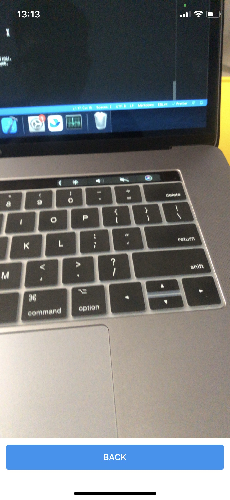

This project was created with [Create React Native App](https://github.com/expo/create-react-native-app).

# How to run

1. Clone project
2. Setup vendor `yarn install`
3. In the project directory, you can run:
   - `yarn start`: Runs the app in the development mode on simulator device.
   - `yarn web`: Runs the app in web.
   - `yarn ios`: Build the iOS App (requires a MacOS computer)
   - `yarn android`: Build the Android App.
   - `expo start`: Runs the app in the expo and then you can run on your real device.
